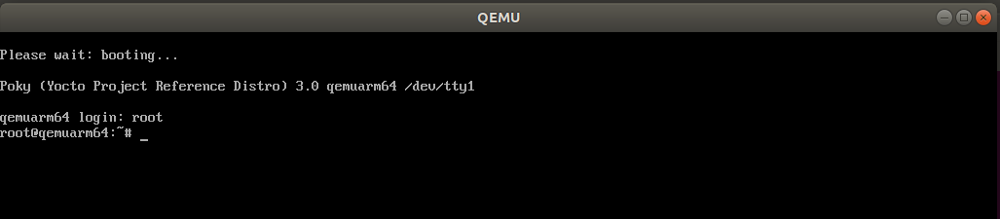

# Yocto_memo

This document shows how to make linux image, run qemu, edit linux kernel source.

## git clone

```
$ git clone git://git.yoctoproject.org/poky
$ cd poke
$ git checkout zeus
```

## setup environment

```
$ source oe-init-build-env build_dir
```

## edit conf/local.conf

```
MACHINE ??= "qemuarm64"

# ...

DISTRO ?= "poky"
```

## bitbake core-image-minimal

```text
+----------------------------------------+
|     bitbake core-image-minimal         |
+----------------------------------------+
                   |
                   V
+----------------------------------------+
|                ???                     | <-- later ...
+----------------------------------------+
                   |
                   V
+----------------------------------------+
|    tmp/deploy/images/qemuarm64/        |
+----------------------------------------+
```

## runqemu

```
runqemu qemuarm tmp/deploy/images/qemuarm64/core-image-minimal-qemuarm64.qemuboot.conf
```

